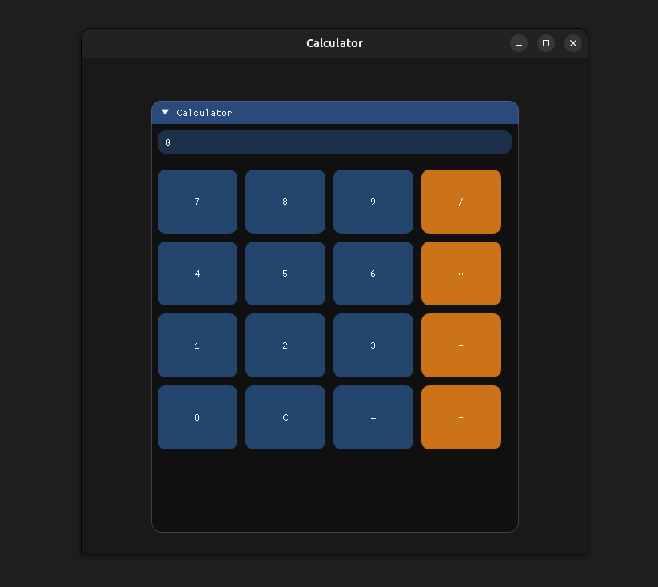

# ImGui Calculator

A simple **GUI calculator** built with **C++** using Dear ImGui, GLFW, and OpenGL.
The project demonstrates how to build a small desktop application with an immediate-mode GUI.

---
# Screenshot


---

## Technologies Used

* Dear ImGui – GUI framework
* GLFW – Window and input handling
* OpenGL – Rendering backend
* C++ – Application logic

---

## Project Structure

```
cpp-calculator/
│
├── main.cpp
├── imgui/
│   ├── imgui.cpp
│   ├── imgui_draw.cpp
│   ├── imgui_tables.cpp
│   ├── imgui_widgets.cpp
│   ├── imgui.h
│   └── backends/
│       ├── imgui_impl_glfw.cpp
│       ├── imgui_impl_glfw.h
│       ├── imgui_impl_opengl3.cpp
│       └── imgui_impl_opengl3.h
```

---

## Requirements

Make sure the following dependencies are installed:

* C++ compiler (g++)
* OpenGL
* GLFW
* X11 development libraries (Linux)

Example installation on Ubuntu/Debian:

```bash
sudo apt install build-essential libglfw3-dev libgl1-mesa-dev
```

---

## Build Instructions

Compile the project using:

```bash
g++ main.cpp \
imgui/imgui.cpp \
imgui/imgui_draw.cpp \
imgui/imgui_tables.cpp \
imgui/imgui_widgets.cpp \
imgui/backends/imgui_impl_glfw.cpp \
imgui/backends/imgui_impl_opengl3.cpp \
-Iimgui -Iimgui/backends \
-lglfw -lGL -ldl -lX11 -pthread -o calculator
```

---

## Run

After compilation, start the application:

```bash
./calculator
```
---
THX
